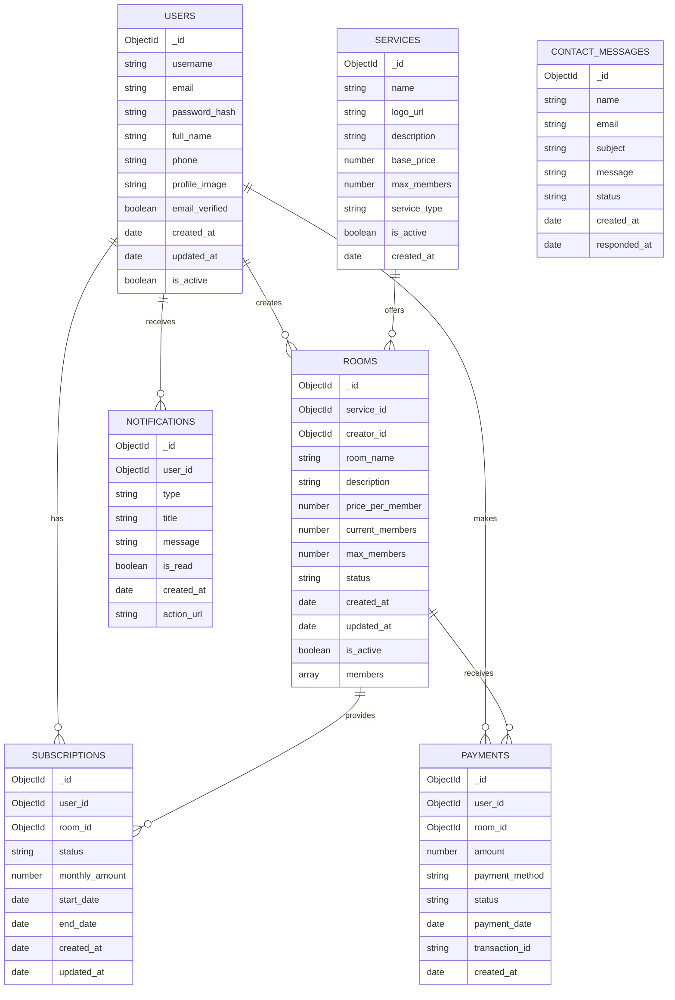

# SubSplit MongoDB Schema

## Collections Overview



## Collection Schemas

### 1. Users Collection
```javascript
{
  _id: ObjectId,
  username: { type: String, required: true, unique: true },
  email: { type: String, required: true, unique: true },
  password_hash: { type: String, required: true },
  full_name: { type: String, required: true },
  phone: String,
  profile_image: String,
  email_verified: { type: Boolean, default: false },
  created_at: { type: Date, default: Date.now },
  updated_at: { type: Date, default: Date.now },
  is_active: { type: Boolean, default: true }
}
```

### 2. Services Collection
```javascript
{
  _id: ObjectId,
  name: { type: String, required: true },
  logo_url: String,
  description: String,
  base_price: { type: Number, required: true },
  max_members: { type: Number, required: true },
  service_type: { 
    type: String, 
    enum: ['streaming', 'music', 'gaming', 'software', 'other'],
    required: true 
  },
  is_active: { type: Boolean, default: true },
  created_at: { type: Date, default: Date.now }
}
```

### 3. Rooms Collection
```javascript
{
  _id: ObjectId,
  service_id: { type: ObjectId, ref: 'Services', required: true },
  creator_id: { type: ObjectId, ref: 'Users', required: true },
  room_name: { type: String, required: true },
  description: String,
  price_per_member: { type: Number, required: true },
  current_members: { type: Number, default: 1 },
  max_members: { type: Number, required: true },
  status: { 
    type: String, 
    enum: ['open', 'full', 'closed', 'expired'],
    default: 'open' 
  },
  created_at: { type: Date, default: Date.now },
  updated_at: { type: Date, default: Date.now },
  is_active: { type: Boolean, default: true },
  members: [{
    user_id: { type: ObjectId, ref: 'Users' },
    role: { type: String, enum: ['creator', 'admin', 'member'], default: 'member' },
    joined_at: { type: Date, default: Date.now },
    left_at: Date,
    status: { type: String, enum: ['active', 'inactive', 'left'], default: 'active' },
    amount_paid: { type: Number, default: 0 },
    last_payment: Date
  }]
}
```

### 4. Subscriptions Collection
```javascript
{
  _id: ObjectId,
  user_id: { type: ObjectId, ref: 'Users', required: true },
  room_id: { type: ObjectId, ref: 'Rooms', required: true },
  status: { 
    type: String, 
    enum: ['active', 'expired', 'cancelled', 'pending'],
    default: 'pending' 
  },
  monthly_amount: { type: Number, required: true },
  start_date: { type: Date, required: true },
  end_date: Date,
  created_at: { type: Date, default: Date.now },
  updated_at: { type: Date, default: Date.now }
}
```

### 5. Payments Collection
```javascript
{
  _id: ObjectId,
  user_id: { type: ObjectId, ref: 'Users', required: true },
  room_id: { type: ObjectId, ref: 'Rooms', required: true },
  amount: { type: Number, required: true },
  payment_method: { 
    type: String, 
    enum: ['credit_card', 'paypal', 'bank_transfer', 'crypto'],
    required: true 
  },
  status: { 
    type: String, 
    enum: ['pending', 'completed', 'failed', 'refunded'],
    default: 'pending' 
  },
  payment_date: Date,
  transaction_id: String,
  created_at: { type: Date, default: Date.now }
}
```

### 6. Notifications Collection
```javascript
{
  _id: ObjectId,
  user_id: { type: ObjectId, ref: 'Users', required: true },
  type: { 
    type: String, 
    enum: ['payment', 'room_invite', 'subscription_expiry', 'system', 'contact'],
    required: true 
  },
  title: { type: String, required: true },
  message: { type: String, required: true },
  is_read: { type: Boolean, default: false },
  created_at: { type: Date, default: Date.now },
  action_url: String
}
```

### 7. Contact Messages Collection
```javascript
{
  _id: ObjectId,
  name: { type: String, required: true },
  email: { type: String, required: true },
  subject: { type: String, required: true },
  message: { type: String, required: true },
  status: { 
    type: String, 
    enum: ['new', 'read', 'responded', 'closed'],
    default: 'new' 
  },
  created_at: { type: Date, default: Date.now },
  responded_at: Date
}
```

## Indexes

```javascript
// Users collection
db.users.createIndex({ "email": 1 }, { unique: true })
db.users.createIndex({ "username": 1 }, { unique: true })
db.users.createIndex({ "is_active": 1 })

// Services collection
db.services.createIndex({ "service_type": 1 })
db.services.createIndex({ "is_active": 1 })

// Rooms collection
db.rooms.createIndex({ "service_id": 1 })
db.rooms.createIndex({ "creator_id": 1 })
db.rooms.createIndex({ "status": 1 })
db.rooms.createIndex({ "is_active": 1 })
db.rooms.createIndex({ "members.user_id": 1 })

// Subscriptions collection
db.subscriptions.createIndex({ "user_id": 1 })
db.subscriptions.createIndex({ "room_id": 1 })
db.subscriptions.createIndex({ "status": 1 })

// Payments collection
db.payments.createIndex({ "user_id": 1 })
db.payments.createIndex({ "room_id": 1 })
db.payments.createIndex({ "status": 1 })
db.payments.createIndex({ "payment_date": 1 })

// Notifications collection
db.notifications.createIndex({ "user_id": 1 })
db.notifications.createIndex({ "is_read": 1 })
db.notifications.createIndex({ "type": 1 })

// Contact messages collection
db.contact_messages.createIndex({ "status": 1 })
db.contact_messages.createIndex({ "created_at": 1 })
```

## Sample Data

### Services
```javascript
db.services.insertMany([
  {
    name: "Netflix Premium",
    logo_url: "/images/netflix-logo.png",
    description: "Ultra HD streaming with 4 screens",
    base_price: 15.99,
    max_members: 4,
    service_type: "streaming",
    is_active: true
  },
  {
    name: "Spotify Family",
    logo_url: "/images/spotify-logo.png", 
    description: "Premium music for up to 6 family members",
    base_price: 14.99,
    max_members: 6,
    service_type: "music",
    is_active: true
  },
  {
    name: "Disney+ Premium",
    logo_url: "/images/disney-logo.png",
    description: "Disney, Pixar, Marvel, and Star Wars content",
    base_price: 7.99,
    max_members: 4,
    service_type: "streaming",
    is_active: true
  }
])
``` 