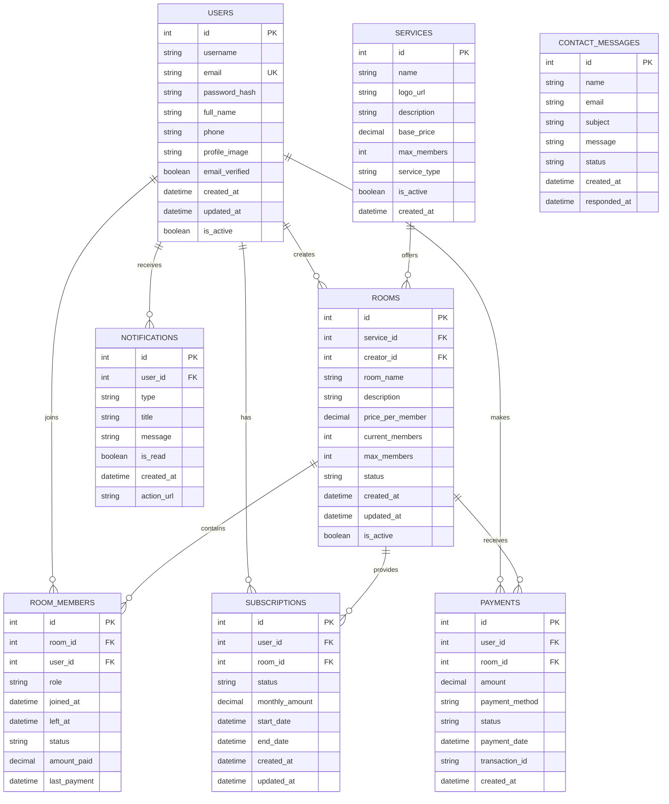

# SubSplit Database Schema

## Entity Relationship Diagram



## Table Definitions

### 1. USERS Table
```sql
CREATE TABLE users (
    id INT PRIMARY KEY AUTO_INCREMENT,
    username VARCHAR(50) UNIQUE NOT NULL,
    email VARCHAR(100) UNIQUE NOT NULL,
    password_hash VARCHAR(255) NOT NULL,
    full_name VARCHAR(100) NOT NULL,
    phone VARCHAR(20),
    profile_image VARCHAR(255),
    email_verified BOOLEAN DEFAULT FALSE,
    created_at TIMESTAMP DEFAULT CURRENT_TIMESTAMP,
    updated_at TIMESTAMP DEFAULT CURRENT_TIMESTAMP ON UPDATE CURRENT_TIMESTAMP,
    is_active BOOLEAN DEFAULT TRUE
);
```

### 2. SERVICES Table
```sql
CREATE TABLE services (
    id INT PRIMARY KEY AUTO_INCREMENT,
    name VARCHAR(100) NOT NULL,
    logo_url VARCHAR(255),
    description TEXT,
    base_price DECIMAL(10,2) NOT NULL,
    max_members INT NOT NULL,
    service_type ENUM('streaming', 'music', 'gaming', 'software', 'other') NOT NULL,
    is_active BOOLEAN DEFAULT TRUE,
    created_at TIMESTAMP DEFAULT CURRENT_TIMESTAMP
);
```

### 3. ROOMS Table
```sql
CREATE TABLE rooms (
    id INT PRIMARY KEY AUTO_INCREMENT,
    service_id INT NOT NULL,
    creator_id INT NOT NULL,
    room_name VARCHAR(100) NOT NULL,
    description TEXT,
    price_per_member DECIMAL(10,2) NOT NULL,
    current_members INT DEFAULT 1,
    max_members INT NOT NULL,
    status ENUM('open', 'full', 'closed', 'expired') DEFAULT 'open',
    created_at TIMESTAMP DEFAULT CURRENT_TIMESTAMP,
    updated_at TIMESTAMP DEFAULT CURRENT_TIMESTAMP ON UPDATE CURRENT_TIMESTAMP,
    is_active BOOLEAN DEFAULT TRUE,
    FOREIGN KEY (service_id) REFERENCES services(id),
    FOREIGN KEY (creator_id) REFERENCES users(id)
);
```

### 4. ROOM_MEMBERS Table
```sql
CREATE TABLE room_members (
    id INT PRIMARY KEY AUTO_INCREMENT,
    room_id INT NOT NULL,
    user_id INT NOT NULL,
    role ENUM('creator', 'admin', 'member') DEFAULT 'member',
    joined_at TIMESTAMP DEFAULT CURRENT_TIMESTAMP,
    left_at TIMESTAMP NULL,
    status ENUM('active', 'inactive', 'left') DEFAULT 'active',
    amount_paid DECIMAL(10,2) DEFAULT 0.00,
    last_payment TIMESTAMP NULL,
    FOREIGN KEY (room_id) REFERENCES rooms(id),
    FOREIGN KEY (user_id) REFERENCES users(id),
    UNIQUE KEY unique_room_user (room_id, user_id)
);
```

### 5. SUBSCRIPTIONS Table
```sql
CREATE TABLE subscriptions (
    id INT PRIMARY KEY AUTO_INCREMENT,
    user_id INT NOT NULL,
    room_id INT NOT NULL,
    status ENUM('active', 'expired', 'cancelled', 'pending') DEFAULT 'pending',
    monthly_amount DECIMAL(10,2) NOT NULL,
    start_date DATE NOT NULL,
    end_date DATE,
    created_at TIMESTAMP DEFAULT CURRENT_TIMESTAMP,
    updated_at TIMESTAMP DEFAULT CURRENT_TIMESTAMP ON UPDATE CURRENT_TIMESTAMP,
    FOREIGN KEY (user_id) REFERENCES users(id),
    FOREIGN KEY (room_id) REFERENCES rooms(id)
);
```

### 6. PAYMENTS Table
```sql
CREATE TABLE payments (
    id INT PRIMARY KEY AUTO_INCREMENT,
    user_id INT NOT NULL,
    room_id INT NOT NULL,
    amount DECIMAL(10,2) NOT NULL,
    payment_method ENUM('credit_card', 'paypal', 'bank_transfer', 'crypto') NOT NULL,
    status ENUM('pending', 'completed', 'failed', 'refunded') DEFAULT 'pending',
    payment_date TIMESTAMP NULL,
    transaction_id VARCHAR(100),
    created_at TIMESTAMP DEFAULT CURRENT_TIMESTAMP,
    FOREIGN KEY (user_id) REFERENCES users(id),
    FOREIGN KEY (room_id) REFERENCES rooms(id)
);
```

### 7. NOTIFICATIONS Table
```sql
CREATE TABLE notifications (
    id INT PRIMARY KEY AUTO_INCREMENT,
    user_id INT NOT NULL,
    type ENUM('payment', 'room_invite', 'subscription_expiry', 'system', 'contact') NOT NULL,
    title VARCHAR(200) NOT NULL,
    message TEXT NOT NULL,
    is_read BOOLEAN DEFAULT FALSE,
    created_at TIMESTAMP DEFAULT CURRENT_TIMESTAMP,
    action_url VARCHAR(255),
    FOREIGN KEY (user_id) REFERENCES users(id)
);
```

### 8. CONTACT_MESSAGES Table
```sql
CREATE TABLE contact_messages (
    id INT PRIMARY KEY AUTO_INCREMENT,
    name VARCHAR(100) NOT NULL,
    email VARCHAR(100) NOT NULL,
    subject VARCHAR(200) NOT NULL,
    message TEXT NOT NULL,
    status ENUM('new', 'read', 'responded', 'closed') DEFAULT 'new',
    created_at TIMESTAMP DEFAULT CURRENT_TIMESTAMP,
    responded_at TIMESTAMP NULL
);
```

## Sample Data

### Services
```sql
INSERT INTO services (name, logo_url, description, base_price, max_members, service_type) VALUES
('Netflix Premium', '/images/netflix-logo.png', 'Ultra HD streaming with 4 screens', 15.99, 4, 'streaming'),
('Spotify Family', '/images/spotify-logo.png', 'Premium music for up to 6 family members', 14.99, 6, 'music'),
('Disney+ Premium', '/images/disney-logo.png', 'Disney, Pixar, Marvel, and Star Wars content', 7.99, 4, 'streaming'),
('YouTube Premium', '/images/youtube-logo.png', 'Ad-free YouTube with background play', 11.99, 6, 'streaming'),
('Amazon Prime', '/images/amazon-logo.png', 'Prime Video, Music, and shipping benefits', 14.99, 6, 'streaming');
```

## Indexes for Performance

```sql
-- User lookups
CREATE INDEX idx_users_email ON users(email);
CREATE INDEX idx_users_username ON users(username);

-- Room queries
CREATE INDEX idx_rooms_service ON rooms(service_id);
CREATE INDEX idx_rooms_status ON rooms(status);
CREATE INDEX idx_rooms_creator ON rooms(creator_id);

-- Membership queries
CREATE INDEX idx_room_members_room ON room_members(room_id);
CREATE INDEX idx_room_members_user ON room_members(user_id);
CREATE INDEX idx_room_members_status ON room_members(status);

-- Subscription queries
CREATE INDEX idx_subscriptions_user ON subscriptions(user_id);
CREATE INDEX idx_subscriptions_status ON subscriptions(status);

-- Payment queries
CREATE INDEX idx_payments_user ON payments(user_id);
CREATE INDEX idx_payments_status ON payments(status);
CREATE INDEX idx_payments_date ON payments(payment_date);

-- Notification queries
CREATE INDEX idx_notifications_user ON notifications(user_id);
CREATE INDEX idx_notifications_read ON notifications(is_read);
CREATE INDEX idx_notifications_type ON notifications(type);
``` 